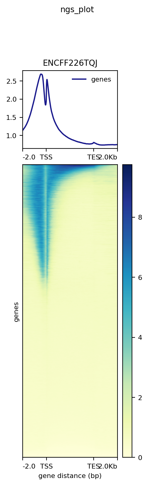
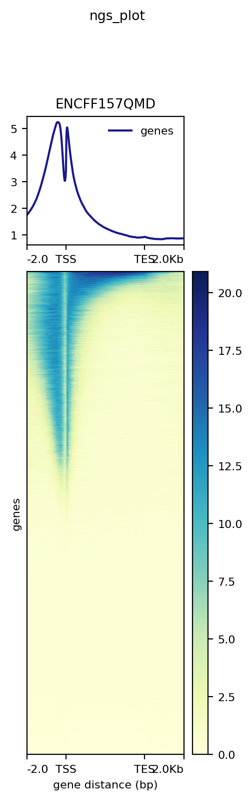

## [IPYNB](data/Gan_ChIP_seq_on_histones.ipynb)
Коллаб умер и не хотел сохраняться из-за проблем с диском, поэтому так ʕʘ‿ಠʔ

## Выдача FastQC
#### [ENCFF002AYC](data/ENCFF002AYC_fastqc.html) - Реплика 1
#### [ENCFF002AVT](data/ENCFF002AVT_fastqc.html) - Реплика 2
#### [ENCFF002BBC](data/ENCFF002BBC_fastqc.html) - Контроль
Подрезать чтения не понадобилось

## Статистика

Название | Риды | Уникально | Неуникально | Нет выравниваний
-|-|-|-|-
ENCFF002AYC | 42224764 | 1474101 (3.49%) | 4201933 (9.95%) |36548730 (86.56%)
ENCFF002AVT | 26657759 | 795832 (2.99%) | 2178781 (8.17%) | 23683146 (88.84%)
ENCFF002BBC | 42527005 | 1589790 (3.74%) |  5047639 (11.87%) | 35889576 (84.39%)

## Венна
Название | Our vs ENCODE | ENCODE vs Our
-|-|-
ENCFF002AYC | [pdf](data/1.pdf) | [pdf](data/2.pdf)
ENCFF002AVT | [pdf](data/3.pdf) | [pdf](data/4.pdf)

## Ответы

##### Проанализируйте выдачу bowtie. Почему процент выравниваний получился именно таким?

Мы работаем только с одной хромосомой, а не с целым геномом, то есть риды выравниваются только на не очень большой фрагмент генома, соответственно, часть их остается некартированной.

##### Проанализируйте полученные результаты и приведите свои рассуждения в README.md. Как можно объяснить различия в количестве пересечений?

Цифры в пересечениях различаются, т.к. сначала выводится число наших пиков, которые есть и в файле ENCODE, а во втором считается число пиков ENCODE, которые есть у нас. Данные могут быть не полностью симметричны, т.к. на 1 пик может приходиться несколько из другого файла и наоборот

## Бонус

1 | 2
-|-
 | 

Распределение похоже на данные из статьи
